<p align="center">
  
</p>

<h1 align="center">BloodLink</h1>

<p align="center">
  <strong>Connecting Lives Through Blood Donation</strong>
</p>

<p align="center">
  
  
  
  
  
  
</p>

---

## Overview

**BloodLink** is a modern Android blood donation app built with Jetpack Compose and Firebase. It connects blood donors with patients in need across Egypt, making the donation process faster, easier, and more accessible. The app supports both Arabic and English with automatic device language detection and full RTL support.

> DEPI Graduation Project — Mobile Development Track

---

## Features

### Authentication
- Google Sign-In integration
- Complete profile setup flow for new users

### Home Dashboard
- Personalized greeting based on time of day
- Donation eligibility status with countdown timer
- Dynamic health tips for donors
- Urgent blood request appeals nearby
- Blood type filter for quick browsing
- Availability toggle — mark yourself as available to donate

### Blood Requests
- Create blood donation requests with hospital location, blood type, and units needed
- Real-time request status tracking (Active, Completed, Cancelled, Expired)
- Manage your own requests — adjust units, view donor log, confirm deliveries
- Browse and respond to community requests feed
- Request details with hospital navigation via Google Maps

### Notifications
- Push notifications via Firebase Cloud Messaging (FCM)
- In-app notification center with read/unread tracking
- Mark all as read functionality

### Profile & History
- View and manage your profile
- Complete donation history with status tracking
- Cancel pending donations

### Localization
- Full Arabic and English support
- Automatic device language detection on first launch
- Manual language override in profile settings
- Complete RTL layout support for Arabic

---

## Tech Stack

| Layer | Technology |
|-------|-----------|
| **Language** | Kotlin |
| **UI Framework** | Jetpack Compose with Material 3 |
| **Architecture** | MVVM (ViewModel + StateFlow + collectAsState) |
| **Navigation** | Navigation Compose 2.9.8 |
| **Authentication** | Firebase Auth + Google Sign-In (Play Services Auth 21.0.0) |
| **Database** | Cloud Firestore |
| **Push Notifications** | Firebase Cloud Messaging (FCM) |
| **Location Services** | Google Play Services Location 21.2.0 |
| **Image Loading** | Coil 2.6.0 |
| **Build System** | Gradle KTS |
| **Min SDK** | 30 (Android 11) |
| **Target SDK** | 36 |

---

## Architecture

```
┌──────────────────────────────────────────────┐
│                 Presentation                  │
│         (Compose UI + ViewModels)            │
├──────────────────────────────────────────────┤
│                   Domain                      │
│        (Models + Enums + Use Cases)          │
├──────────────────────────────────────────────┤
│                    Data                       │
│    (Firebase Remote + Local + Repositories)  │
└──────────────────────────────────────────────┘
```

The app follows a clean MVVM architecture with clear separation of concerns:

- **Presentation Layer** — Compose screens, UI components, and ViewModels that expose state via `StateFlow`
- **Domain Layer** — Business models, enums (blood types, request status, priorities), and use cases
- **Data Layer** — Firebase repositories, remote data sources, and local storage (SharedPreferences)

---

## Project Structure

```
app/src/main/java/com/example/depi_final_project_bloodbank/
├── components/              # Shared app-level components
├── data/
│   ├── local/               # SharedPreferences & local storage
│   ├── locale/              # LocaleManager for language switching
│   ├── remote/              # Firebase data sources
│   ├── repo/                # Repository implementations
│   └── repository/          # Repository interfaces
├── domain/
│   ├── enums/               # BloodType, RequestStatus, DonationStatus, etc.
│   ├── model/               # Data models (BloodRequest, User, Notification, etc.)
│   └── use_case/            # Business logic use cases
├── navigation/              # Navigation graph & route definitions
├── ui/
│   ├── common_components/   # Reusable UI components
│   ├── screens/
│   │   ├── auth/            # Login, Register, Profile setup
│   │   ├── home/            # Home dashboard & components
│   │   ├── notification/    # Notification center
│   │   ├── orders/          # Request management & details
│   │   ├── profile/         # Profile & donation history
│   │   └── request/         # Create blood request
│   └── theme/               # Material 3 theme, colors, typography
└── utils/                   # Extension functions & utilities
```

---

## Screenshots

| Login | Register | Home |
|-------|----------|------|
| 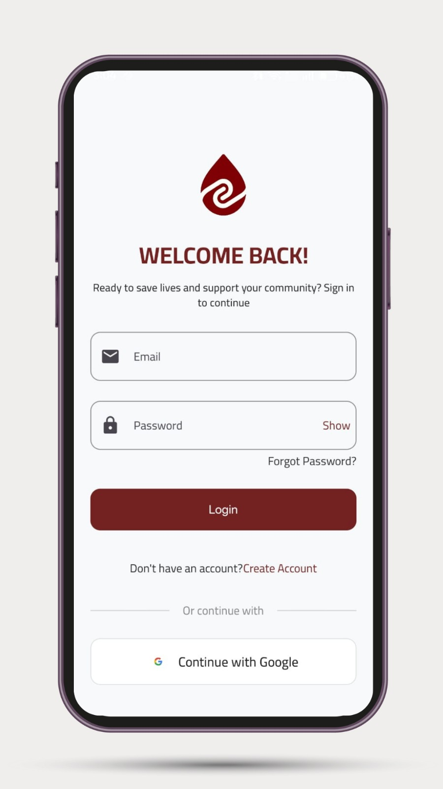 | 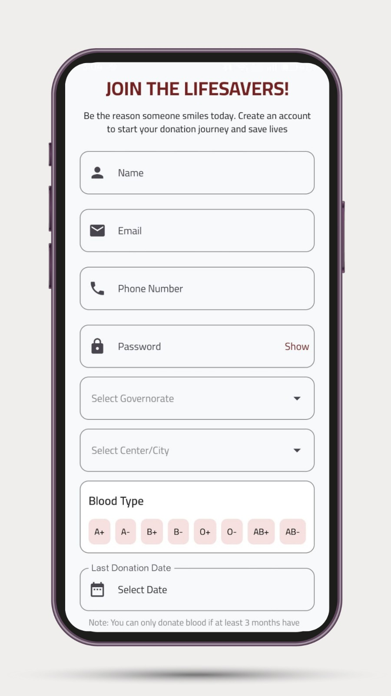 | 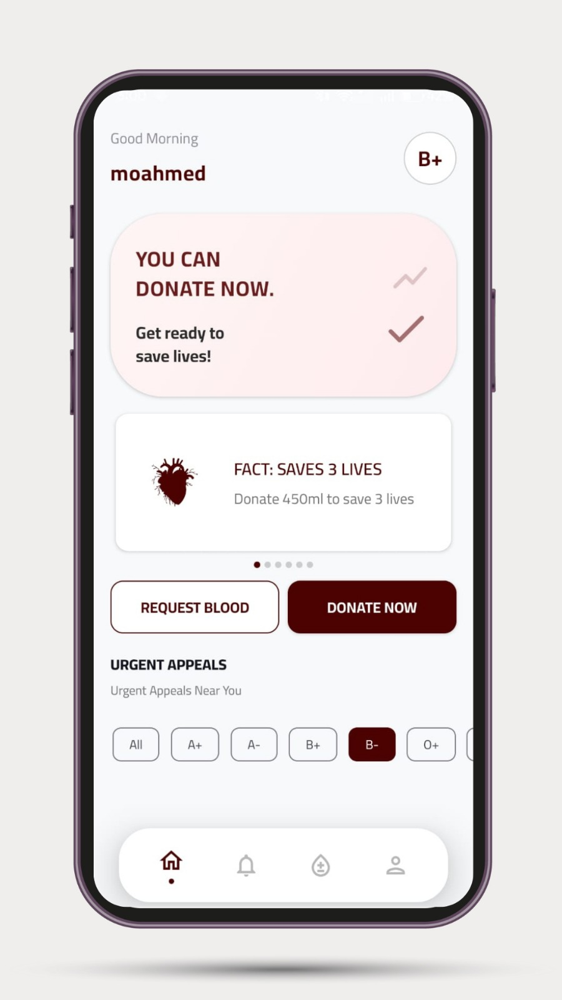 |

| Notifications | Requests Feed | My Activity |
|----------------|---------------|-------------|
| 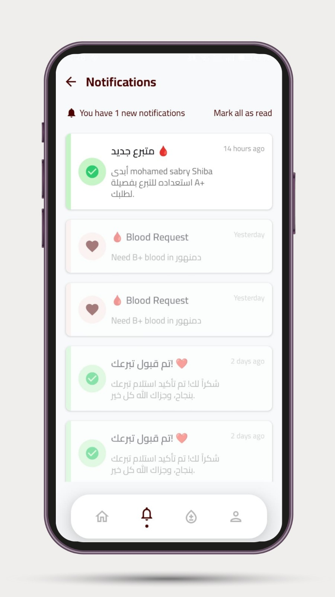 | 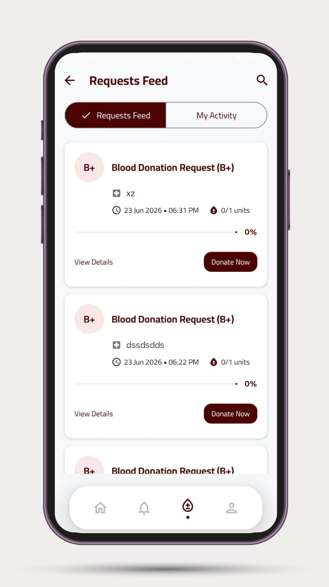 | 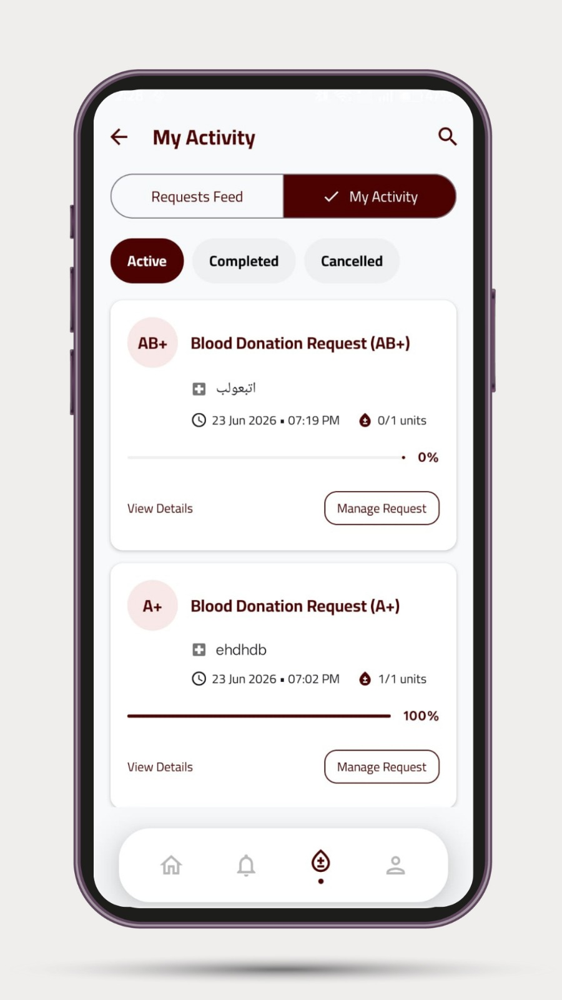 |

| Create Request | Manage Request | Request Details |
|-----------------|-----------------|------------------|
| 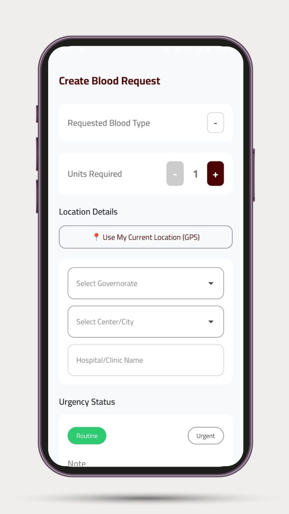 | 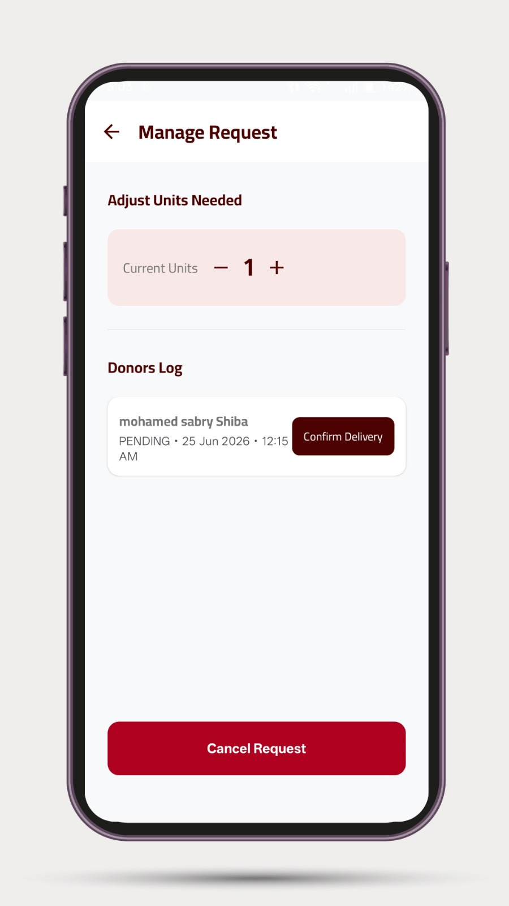 | 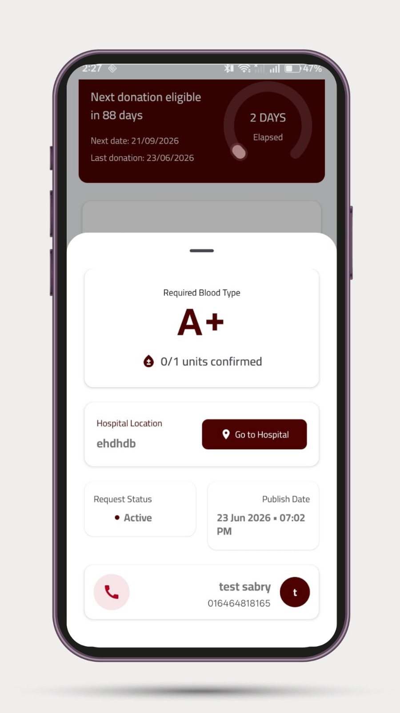 |

| Profile | Donation History |
|---------|-------------------|
| 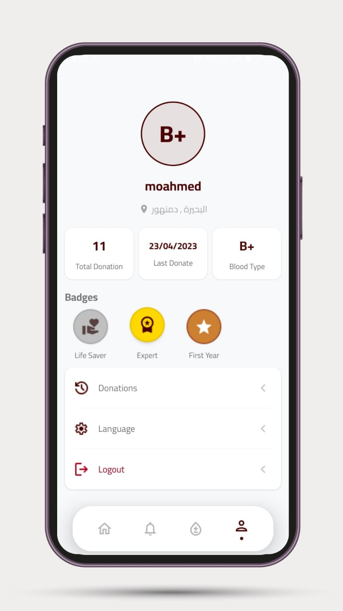 | 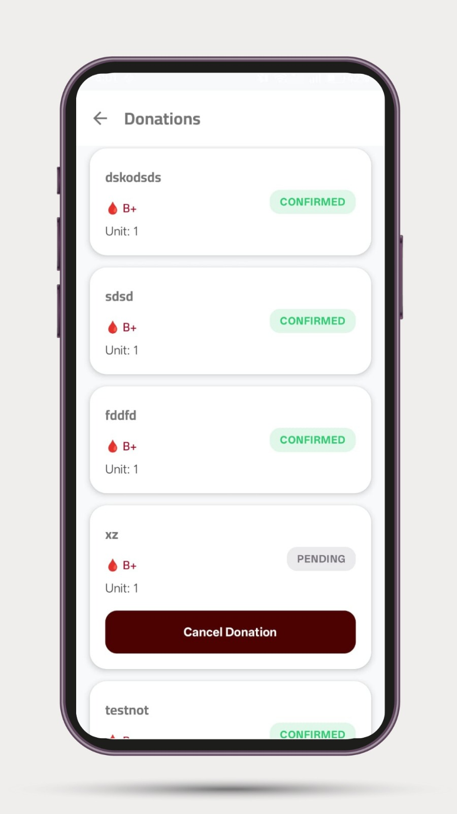 |

---

## Getting Started

### Prerequisites

- Android Studio Ladybug or later
- JDK 17+
- An Android device or emulator running API 30+
- A Firebase project with Firestore, Authentication, and Cloud Messaging enabled

### Setup

1. **Clone the repository**
   ```bash
   git clone https://github.com/Yusef3bdulkarim/DEPI-Final-Project-BloodBank.git
   cd DEPI-Final-Project-BloodBank
   ```

2. **Firebase Configuration**
   - Create a Firebase project at [console.firebase.google.com](https://console.firebase.google.com)
   - Enable **Authentication** (Google Sign-In provider)
   - Enable **Cloud Firestore**
   - Enable **Cloud Messaging**
   - Download `google-services.json` and place it in `app/`

3. **Google Sign-In**
   - In Firebase Console, go to Authentication > Sign-in method > Google
   - Add your SHA-1 fingerprint (debug and release)

4. **Build & Run**
   ```bash
   ./gradlew assembleDebug
   ```
   Or open in Android Studio and run on a connected device/emulator.

---

## Firebase Collections

| Collection | Description |
|-----------|-------------|
| `users` | User profiles — name, blood type, location, availability, FCM token |
| `blood_requests` | Blood donation requests — hospital, blood type, units, status, donation log |
| `notifications` | Push notification records — title, body, read status, timestamps |

---

## Contributors

<table>
  <tr>
    <td align="center">
      <a href="https://github.com/Yusef3bdulkarim">
        <br/>
        <sub><b>Yusef Abdulkarim Ali</b></sub><br/>
        <sub>Team Leader</sub>
      </a>
    </td>
    <td align="center">
      <a href="https://github.com/Mohamed-Ahmed-Sabry22">
        <br/>
        <sub><b>Mohammed Sabry</b></sub>
      </a>
    </td>
    <td align="center">
      <a href="https://github.com/mo7ammednabil">
        <br/>
        <sub><b>Mohammed Nabil</b></sub>
      </a>
    </td>
  </tr>
  <tr>
    <td align="center">
      <a href="https://github.com/Nasreldinsayed">
        <br/>
        <sub><b>Nasr Eldin Ali</b></sub>
      </a>
    </td>
    <td align="center">
      <a href="https://github.com/andrewtimmy547-glitch">
        <br/>
        <sub><b>Androw Timmey</b></sub>
      </a>
    </td>
    <td align="center">
      <a href="https://github.com/mustafaEssam10">
        <br/>
        <sub><b>Mostafa Essam</b></sub>
      </a>
    </td>
  </tr>
</table>

---

## License

This project was developed as a graduation project for the **DEPI Mobile Development Track** and is available for educational purposes.

---

<p align="center">
  Made with ❤️ in Egypt
</p>
